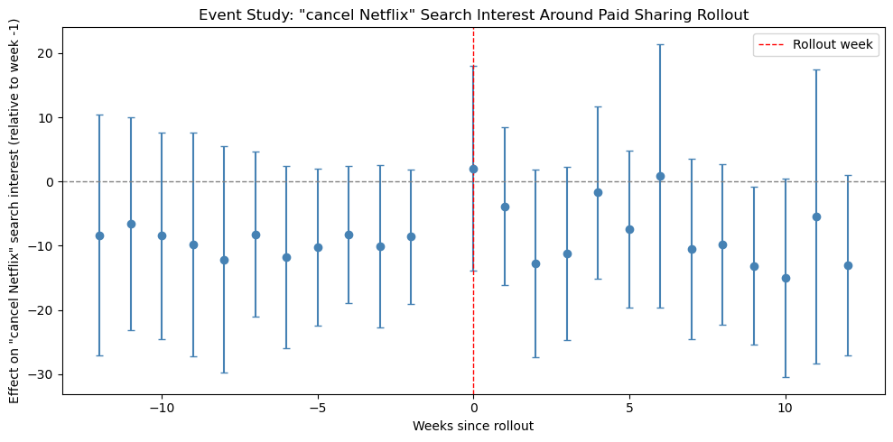

# Estimating the Causal Effect of Netflix's Paid Sharing Rollout

## Overview

In 2023, Netflix rolled out its "paid sharing" policy ending free password sharing outside a household across the globe in five distinct waves rather than all at once. This staggered rollout creates a natural quasi-experiment: since different countries were treated at different times, difference-in-differences (DiD) can be used to estimate whether the policy caused a measurable shift in user behavior, without needing a designed A/B test.

This project uses Google search interest as a behavioral proxy to ask: **did Netflix's password-sharing crackdown actually change how people searched for and thought about canceling the service?**

## Data

### 1. Treatment Dates (Rollout Waves)

Netflix's rollout was compiled by hand from public reporting (news coverage and Netflix's own press communications), since no single official source lists exact per-country dates. The rollout occurred in five waves:

| Wave | Date | Countries (examples) |
|---|---|---|
| 1 | March 2022 | Chile, Costa Rica, Peru |
| 2 | July 2022 | Argentina, Guatemala, Honduras, and others |
| 3 | Feb 8, 2023 | Canada, New Zealand, Portugal, Spain |
| 4 | May 23, 2023 | US, UK, Germany, Brazil, Australia, and ~98 others |
| 5 | July 20, 2023 | India, Indonesia, UAE, and others |

Because some countries appeared in multiple source waves (e.g., Argentina piloted a variant in Wave 2, then transitioned to the standard model in Wave 4), duplicates were resolved by keeping each country's **earliest** treatment date, since that's when the policy first affected them.

Due to API rate limits, a subset of 14 countries was selected for analysis — at least 2 per wave, prioritizing larger markets with more reliable search volume — rather than pulling all available countries.

### 2. Outcome Data: Google Trends via SerpApi

Weekly search interest for two terms (**"Netflix"** and **"cancel Netflix"**) was pulled per country using SerpApi's Google Trends endpoint (the common `pytrends` library proved too unreliable due to Google's rate-limiting). Each term was queried **separately per country**, since Google Trends normalizes multi-term queries relative to the highest-volume term in the request, querying "Netflix" and "cancel Netflix" together caused the lower-volume term to be artificially compressed toward zero.

Because Trends data is normalized independently per query, raw values can't be compared directly across countries or across search terms, only a given country's own change over time, relative to its own baseline, is meaningful. This constraint fits difference-in-differences well, since DiD is built around exactly that kind of within-unit comparison.

## Analysis

### Approach 1: Simplified Two-Wave DiD

A classic 2×2 comparison: Wave 3 countries (Canada, Spain) as treatment, Wave 4 countries (not yet rolled out) as control, restricted to a Jan–Apr 2023 window so the control group stayed genuinely untreated throughout.

**Model:** `interest ~ treatment + post + treatment:post`

| Outcome | DiD estimate | p-value |
|---|---|---|
| "Netflix" | −4.53 | 0.023 |
| "cancel Netflix" | +14.50 | <0.001 |

At face value, this suggested general Netflix interest dipped slightly in treated countries relative to control, while cancellation-intent search spiked sharply — a seemingly clean, significant story.

### Approach 2: Event-Study (Staggered DiD)

To validate this result and check the parallel trends assumption properly, the analysis was extended to all 14 countries using an event-study design: time was re-centered around each country's *own* rollout date (rather than one fixed calendar cutoff), with country and month fixed effects added to control for baseline differences and shared time trends. This structure both tests parallel pre-trends and shows the dynamic post-treatment effect, week by week.

**Result:** Pre-rollout weeks were relatively flat, consistent with parallel trends. However, post-rollout weeks showed **no clean, sustained jump** in "cancel Netflix" interest — estimates bounced between roughly -15 and +5 with every weekly confidence interval crossing zero.

### Takeaway

The two approaches disagree, and that disagreement is the most important finding in this project. The simplified two-wave model compressed 12 weeks of noisy data from just 2 treatment countries into a single average, which can make sampling noise look like a clean, significant effect. The event study (using more data and more rigorous controls) did not replicate that result, suggesting the initial significant estimate was likely an artifact of a small, noisy sample rather than a precisely estimated true effect.

**Placebo validation.** A placebo test using a fake treatment date (Oct 2022, when no real rollout occurred) returned insignificant results for both outcomes, confirming the model doesn't spuriously detect effects where none exist. This strengthens confidence in the event-study finding over the initial (and likely overstated) static DiD result.

## Known Limitations

**No true control group.** Netflix rolled out paid sharing to nearly every market it operates in, so this analysis has no "never-treated" countries to serve as a clean baseline. Instead, it uses a staggered adoption design: later-wave countries act as temporary controls for earlier-wave countries, before their own treatment kicks in. This is a standard and accepted approach in DiD, but it means every comparison group is itself treated eventually.

**Rollout dates mark the start, not full completion.** The May 23, 2023 date for Wave 4 (103 countries) reflects when Netflix announced and began the expansion, not necessarily simultaneous, complete rollout in every one of those markets on that exact day. The U.S. rollout in particular was delayed multiple times before landing on this date. Treatment dates should be treated as reasonable approximations rather than precise, verified per-country cutovers.

**Treatment dates vary in precision by wave.** Waves 1, 2, 3, and 5 are backed by specific, well-documented press dates. Wave 4 is treated as a single simultaneous rollout date across all included countries, consistent with how Netflix itself communicated the change. It's possible some countries in this wave saw slight day-to-day variation in actual enforcement, but no public source documents this at a finer grain, and Google Trends' weekly resolution wouldn't be able to detect day-level differences even if it existed.

**Outcome variable is a behavioral proxy, not ground truth.** Google Trends search interest approximates user reaction to the policy change, but it isn't a direct measure of subscriptions, cancellations, or revenue. Spikes or dips in search interest can also be driven by unrelated events (major show releases, news coverage, pricing changes), which the event-study design helps control for but can't fully eliminate.

**Small sample size limits statistical power.** With only 14 countries — further split by search term and by weekly time bins in the event study — confidence intervals are wide, and the analysis may lack power to detect a real effect even if one exists. A larger country sample, a longer observation window, or a less noisy outcome variable would improve precision.